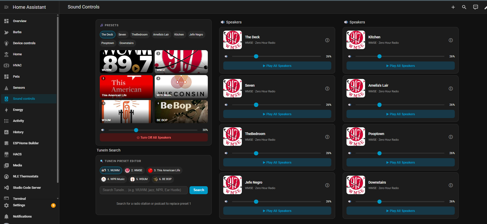

# SoundCork + Home Assistant Integration

Self-hosted Bose SoundTouch cloud replacement with native Home Assistant integration.



Extends [SoundCork](https://github.com/timvw/soundcork) with:
- REST API patch for Home Assistant control
- Custom HA integration (custom_components/soundcork)
- Custom Lovelace card with preset player, TuneIn search, per-speaker volume

## Repository Structure

```
soundcork-server/     - Patched main.py and Dockerfile
ha-integration/       - HA custom integration
lovelace-card/        - Custom Lovelace card
speaker-config/       - Speaker redirect config template
docs/                 - Deployment and setup guides
```

## Quick Start

### 1. Deploy SoundCork

```bash
cd soundcork-server
docker build -t soundcork-local:latest .
docker run -d --name soundcork --restart unless-stopped \
  -p 8000:8000 -v /your/data/dir:/soundcork/data \
  -e base_url=http://YOUR_SERVER_IP:8000 \
  -e data_dir=/soundcork/data \
  -e MGMT_PASSWORD=your_password \
  soundcork-local:latest
```

### 2. Configure Each Speaker

SSH into each speaker (first time: create empty file called remote_services on a FAT32 USB):

```bash
ssh -o HostKeyAlgorithms=+ssh-rsa,ssh-dss -o PubkeyAcceptedKeyTypes=+ssh-rsa,ssh-dss root@SPEAKER_IP
rw
cat speaker-config/SoundTouchSdkPrivateCfg.xml > /opt/Bose/etc/SoundTouchSdkPrivateCfg.xml
touch /mnt/nv/remote_services
reboot
```

Or push to all speakers at once from your server:

```bash
for ip in 192.168.1.X 192.168.1.Y; do
  cat speaker-config/SoundTouchSdkPrivateCfg.xml | \
    ssh -o HostKeyAlgorithms=ssh-rsa -o PubkeyAcceptedKeyTypes=ssh-rsa root@$ip \
    "cat > /opt/Bose/etc/SoundTouchSdkPrivateCfg.xml && touch /mnt/nv/remote_services"
  ssh -o HostKeyAlgorithms=ssh-rsa -o PubkeyAcceptedKeyTypes=ssh-rsa root@$ip reboot
done
```

Edit speaker-config/SoundTouchSdkPrivateCfg.xml and replace YOUR_SERVER_IP first.

### 3. Install the HA Integration

```bash
cp -r ha-integration/custom_components/soundcork /config/custom_components/
```

Restart HA, then Settings > Integrations > Add > SoundCork, enter your SoundCork URL.

### 4. Install the Lovelace Card

```bash
cp lovelace-card/soundcork-preset-editor.js /config/www/
```

Settings > Dashboards > Resources > Add: /local/soundcork-preset-editor.js (JS Module)

## HA Integration Features

- One media_player entity per speaker
- Real-time state via WebSocket (port 8080) + 30s REST poll fallback
- Volume, power, preset selection, now playing with artwork
- Custom services: soundcork.play_preset, soundcork.store_preset_tunein, soundcork.store_preset_radio

## Lovelace Card Modes

```yaml
# Preset player with speaker selector
type: custom:soundcork-preset-editor
mode: player
soundcork_url: http://192.168.1.229:8000
speakers:
  - media_player.speaker_1
  - media_player.speaker_2

# Per-speaker card with volume slider
type: custom:soundcork-preset-editor
mode: speaker
soundcork_url: http://192.168.1.229:8000
speaker_name: The Deck
speakers:
  - media_player.the_deck

# TuneIn search and preset editor
type: custom:soundcork-preset-editor
mode: editor
soundcork_url: http://192.168.1.229:8000
speakers:
  - media_player.speaker_1
```

## API Additions

The main.py patch adds unauthenticated endpoints:

| Endpoint | Method | Description |
|----------|--------|-------------|
| /api/v1/speakers | GET | List speakers |
| /api/v1/speakers/{ip}/now-playing | GET | Now playing |
| /api/v1/speakers/{ip}/volume | GET/POST | Volume |
| /api/v1/speakers/{ip}/presets | GET | Presets |
| /api/v1/speakers/{ip}/store-preset | POST | Save preset |
| /api/v1/speakers/{ip}/select | POST | Play content |
| /api/v1/speakers/{ip}/power-on | POST | Power on |
| /api/v1/speakers/{ip}/power-off | POST | Power off |
| /api/v1/speakers/{ip}/key/{key} | POST | Key press+release |
| /api/v1/tunein/search | GET | Search TuneIn |
| /api/v1/tunein/describe | GET | Station details |

## Credits

- [SoundCork](https://github.com/timvw/soundcork) by timvw
- Bose SoundTouch Web API documentation
